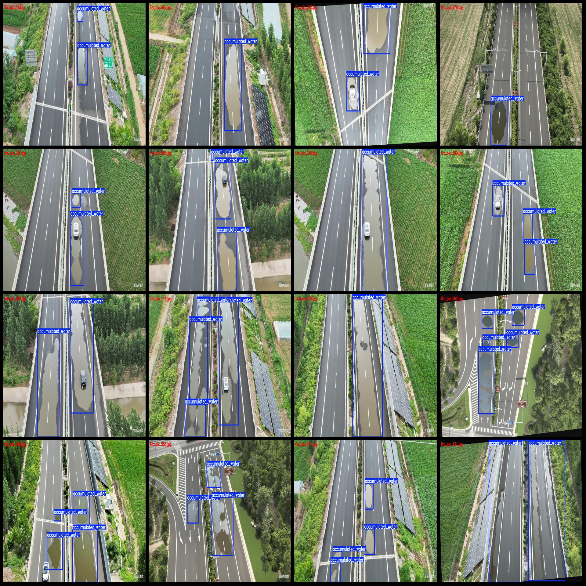
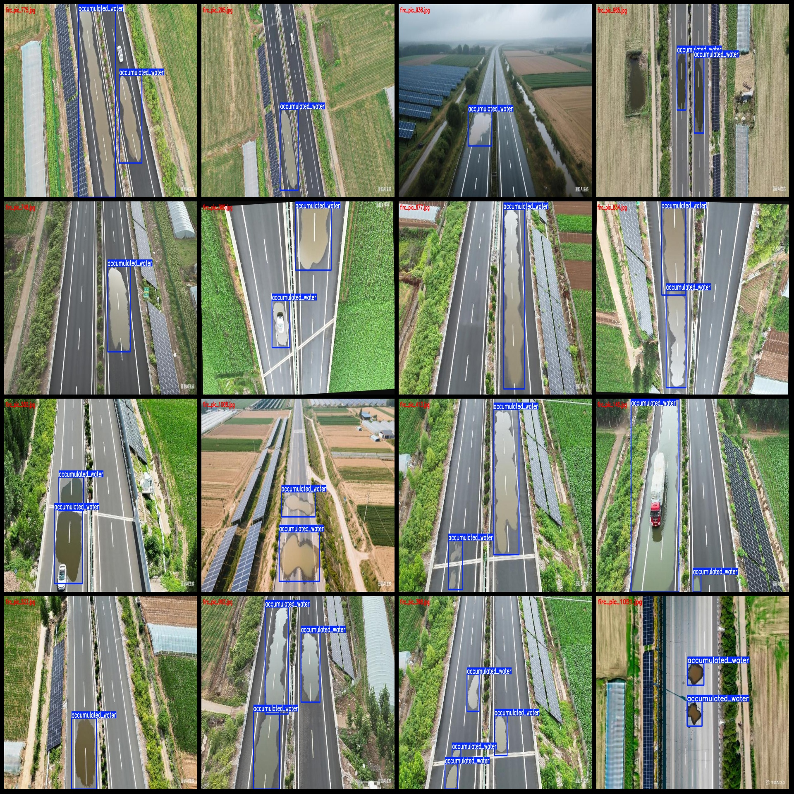

# Drone-View Drone-Observation Highway Roadway Water Accumulation Detection Data Set VOC+YOLO Format 1074 Images 1 Category

Dataset format: Pascal VOC format + YOLO format (txt file without segmentation path, only containing jpg images and corresponding VOC format xml files and yolo format txt files)

Number of images (jpg file count): 1074
Label count (xml file count): 1074
Label count (txt file count): 1074
Number of label categories: 1
Label category name: "accumulated_water"
Each category's number of boxes:
accumulated_water box count = 2822
Total box count: 2822
Number of images each category takes:
accumulated_water takes 1074 images
Image resolution: Multi-resolution images, such as 1312x703, 1312x735 and so on
Using labeling tool: labelImg
Labeling rules: Drawing a rectangular box for the category
Important note: The dataset does not have been divided into training, validation, and test sets. You need to divide them yourself.
Special declaration: This dataset does not guarantee the accuracy of the trained models or weight files.
Image preview:
Label example:

## Images

Here is a pay link on Stripe ( https://buy.stripe.com/3cs8yP7sY87d0vu9AB ). Please contact me lonlonago@foxmail.com after funding $89, and I will send you a complete data files , thank you!

